## 1. [Dev To](https://dev.to/)
***

### Task

> Target the Top description div and change the DEV Community to <Your_Name> and description to your passion

### Original 


### Solution

```
// For Heading
document.querySelector(".side-bar .crayons-card .crayons-subtitle-2").innerHTML = "VARUN GUPTA";

// For Content
document.querySelector(".side-bar .crayons-card .color-base-70").innerHTML = "Aspiring to be best web developer";
```

### Output

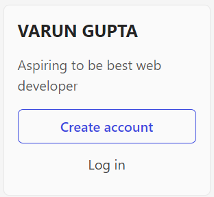

## 2. [Apple](https://support.apple.com/en-in)
***
### Task

> Fetch all the product name and store in an array

### Sample-2


### Solution

```
const queryNodeList = document.querySelectorAll(".as-imagegrid-item-title");
let queryArray = [];

queryNodeList.forEach((item) => {
    let temp = item.firstChild.textContent;
    queryArray.push(temp);
})
```

### Output

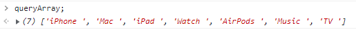

## 3. [youTube Support](https://support.google.com/youtube/#topic=9257498)
***
### Task
> Add another FAQ 'My New FAQ' to the list

### Sample 3


### Solution

```
let accordian = document.getElementsByClassName("accordion-homepage");
let section = document.createElement('section');
let h = document.createElement('h3');
h.innerText = 'My New FAQ';
section.classList.add('parent');
section.appendChild(h);
accordian[0].appendChild(section);
```

### Output


## 4. [OnePlus](https://www.oneplus.in/support)
***

### Task
> Change the contact number

### Sample 4


### Solution

```
document.querySelector(".one-tel-number").innerText = 6265412345;
```

### Output

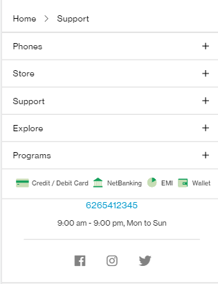

## 5. [Samsung](https://www.samsung.com/in/offer/online/samsung-fest/)
***

### Task
>Target the main div of card and change the Button text to Check out

### Solution

```
document.querySelector(".diwali-deals-product-sale-btn").innerText = "Check Out";
```

### Output

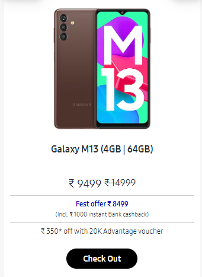

## 6. [Adidas](https://www.adidas.co.in/)
***

### Task
>Target the search box and on hover change thebackground color to red.

### Sample


### Solution

```
let search = document.querySelector(".searchinput___19uW0");

search.addEventListener('mouseenter', () => {search.style.backgroundColor = 'red'});

search.addEventListener('mouseleave', () => {search.style.backgroundColor = 'white'});
```

### Output


## 7. [MDN Web Docs](https://developer.mozilla.org/en-US/)

### Task
>To Search a topic in the MDN Search bar.
     First add a text to search in the search bar and then hit the submit search button to search the docs using DOM

### Sample


### Solution

### output

## 8. [Google](https://www.google.com/)

### Task
> Remove alternate languages from the home page languages listed

### Sample


### Solution

```
let div = document.getElementById('SIvCob');
let a = div.querySelectorAll('a');
for(let i = 0; i < a.length; i++){
    if(i%2 == 0){
        a[i].remove();
    }
}
```

### Output

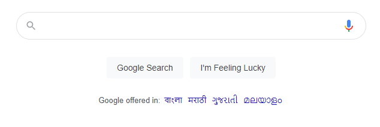

## 9. [Code Wars](https://www.codewars.com/)

### Tasks
> Change the font family of the text to monospace and text color to the logo’s background color.

### Sample


### Solution

### Output


## 10. [Freecodecamp](https://www.freecodecamp.org/)

### Tasks
> Target the button and change background colour on mouseover

### Sample


### Solution

```
let getStarted = document.querySelectorAll(".login-btn-text");
getStarted[1].addEventListener("mouseleave", (event) => {
    event.target.style.backgroundColor = 'red';
});
```

### Output

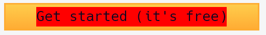

## 11. [realme](https://www.realme.com/in/)

### Task
> change the realme logo to ineuron logo

### Sample 


### Solution

```
let logo = document.querySelector(".icon-logo");
logo.style.backgroundImage = "url('https://ineuron.ai/images/ineuron-logo.png')";
```

### Output


## 12. [Github](https://github.com/)

### Tasks
> change the background colour of the button to blue.

### Sample


### Solution

```
let btn = document.querySelectorAll(".btn-primary");
btn[1].style.backgroundColor = 'blue';
```

### Output

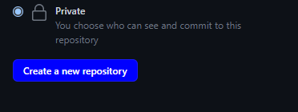

## 13. [Hackerrank](https://www.hackerrank.com/)

### Tasks
> Target the top description and change “Matching developers with great companies” to ‘JSBOOTCAMP“.

### Sample


### Solution
```
let heading = document.querySelector(".fl-heading-text");
heading.innerHTML = "JSBOOTCAMP";
```

### Output
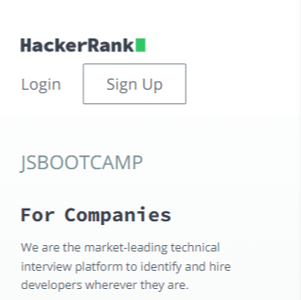

## 14. [Asus](https://www.asus.com/in/)

### Tasks
> change the fontsize of “Hot Deals” to 80px

### Sample


### Solution

```
let heading = document.querySelector(".HotDealsAll__Heading__2fIbe");
heading.style.fontSize = '80px';
```

### Output
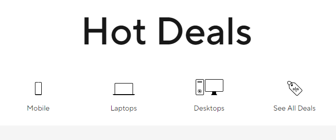

## 15. [Dell](https://www.dell.com/en-in/shop/deals/laptop-deals?gacd=10415953-9016-5761040-285981356-0&dgc=ST&gclid=Cj0KCQjwguGYBhDRARIsAHgRm4-XUDMhhVNyHXb3s1gY4ZBzORr_d9Se-buhJwy7asyUe7YdqEA11eEaAt6UEALw_wcB&gclsrc=aw.ds&nclid=BxjBlpBQsX6pjSHh-L8YYSU77EpfXRkG1AGMB5Wbeu386ykspfrPDnfx_DdFau20)

### Tasks
> Convert the text “G15 Gaming Laptop” from left to right

### Sample


### Solution

```
let title = document.querySelectorAll(".ps-title");
title[1].style.textAlign = 'right';
```

### Output


## 16. [Vercel](https://vercel.com/)

### Tasks
> change the heading “Start with the developer” to “Start with Scratch”

### Sample 


### Solution

```
let secHeading = document.querySelectorAll(".section-title_title__VEDfK");
secHeading[0].innerHTML = "Start with Scratch";
```

### Output

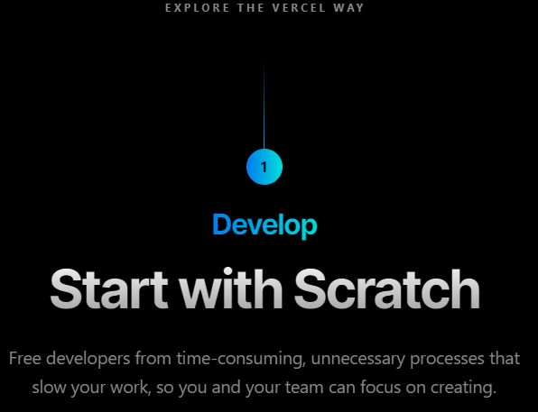

## 17. [Sony](https://www.sony.co.in/)

### Tasks
> change the button text To current Date.

### Sample


### Solution

```
let btnContent = button[0].innerHTML;
let date = new Date();
button[0].innerHTML = date;
```

### Output
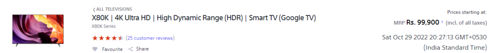

## 18. [Philips](https://www.philips.co.in/)

### Tasks
> change the background colour blue to orange

### Sample


### Solution

```
let footer = document.querySelector(".p-f03-footer-container ");
footer.style.background = 'orange';
```

### Output
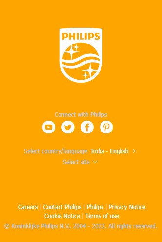

## 19. [Canon](https://in.canon/)

### Tasks
> extract the canon logo

### Sample


### Solution

```
let logo = document.querySelector(".logo");
logo.getAttribute('src');
```

### Output
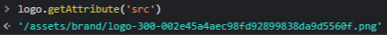

## 20. [Oppo](https://www.oppo.com/in/)

### Tasks
> Change the description colour black to orange

### Sample


### Solution

```
let desc = document.querySelector(".desc");
desc.style.color = 'orange';
```

### Output
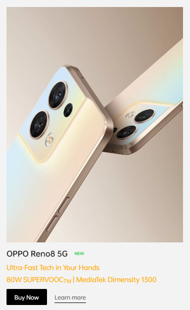
